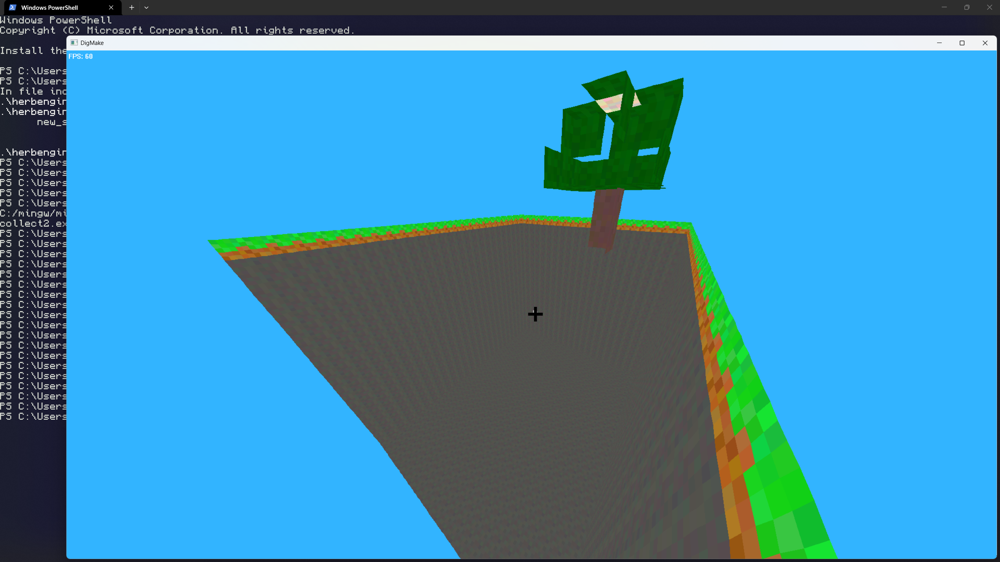
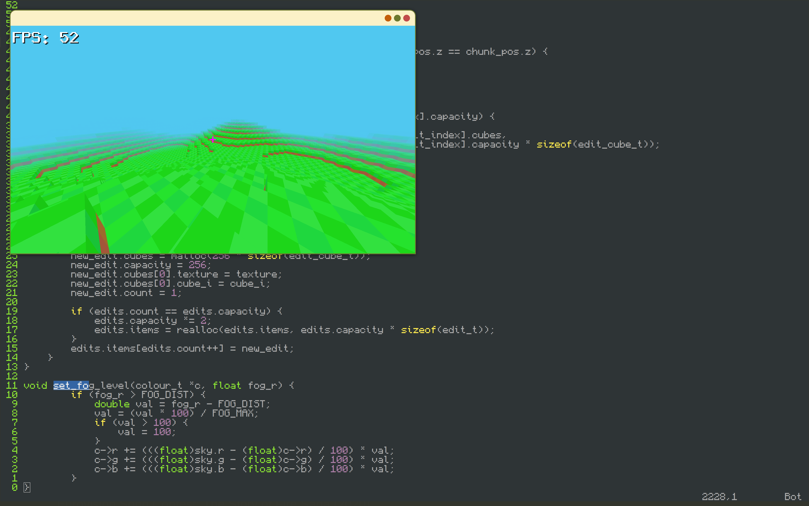

# herb-engine-C3D

Playground for 3D rendering from scratch
I know nothing about graphics, all I want is an array of pixels,
that I can update each frame with my own functions,
this is my attempt to make a 3D game like minecraft!
I have used gpt to help write the x11 or winapi parts of the code,
so I can just have my array of pixels that I update each frame.
I also used gpt to make the write and read PPM functions as this does not
interest me, and also for perlin noise, as this is outside the scope of this project
but I thought it would be nice to have. Everything else is from scratch!

Work done so far:
 - a fill function that takes 4 points and a colour, and fills the screen with that colour
 - a rotate and project function that takes an x y and z and rotates it about the camera, and projects it by z
 - a texture map, which takes each square, and colours it pixel by pixel from a given texture
 - sort each square by their distance to the camera
 - simple cubicy collisions
 - simple hotbar
 - don't draw back faces, or faces with a neighbouring face
 - placing and removing cubes within any chunk
 - chunk system with dynamically saved chunk edits
 - chunk generation from a given noise function
 - tree generation saved using the chunk edits
 - fog at chunk borders
 - day night cycle

Known issues:
 - collision issues when passing chunk borders
 - rendering issues when some points of a square have negative z values

Next steps:
 - from profiling I can see that the fill square function accounts for nearly half the total program instructions
 - cache hits seem good, so the next step would be to come up with a faster fill square algorithm...
 - I tried a few similar variations with fewer conditionals, but with little difference...

To compile:
 - linux:  
   - gcc -o main.o -lX11 -lm -O3 -march=native ./linux2.c  
 - Windows:  
   - gcc -o main.exe -lgdi32 -mwindows -O3 -march=native .\main-windows.c  

Dev screenshots:

